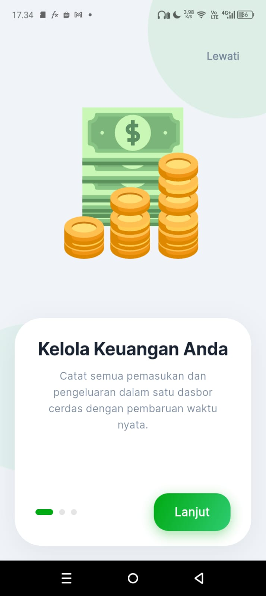
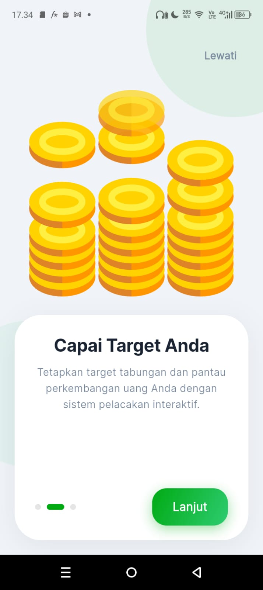
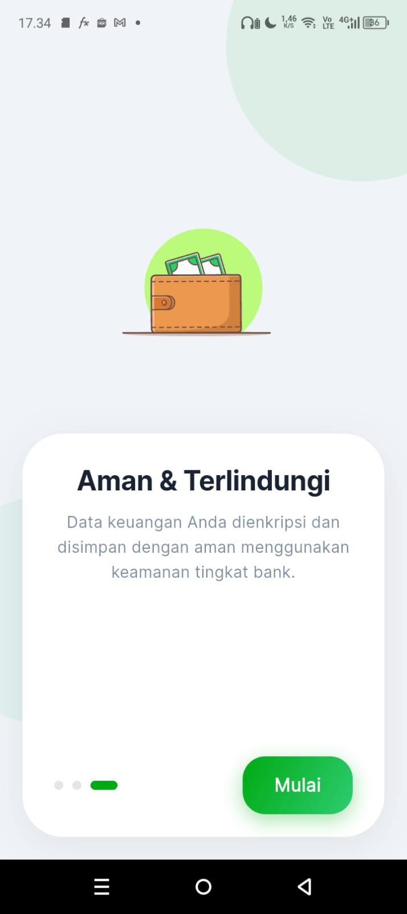
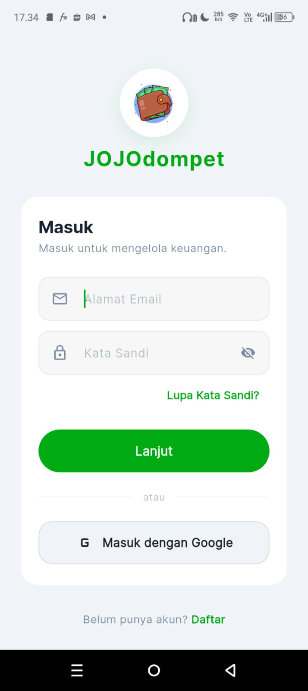
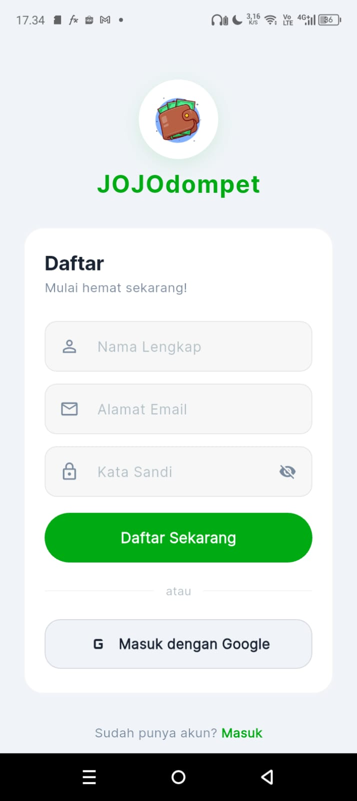
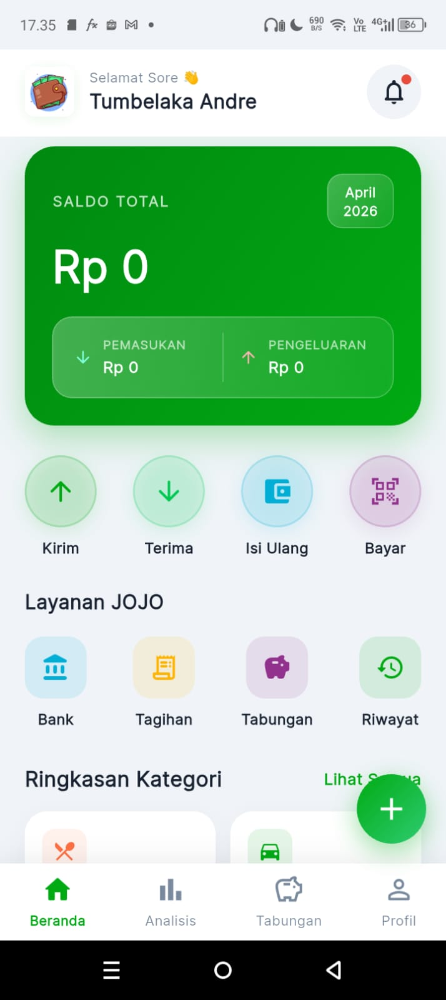
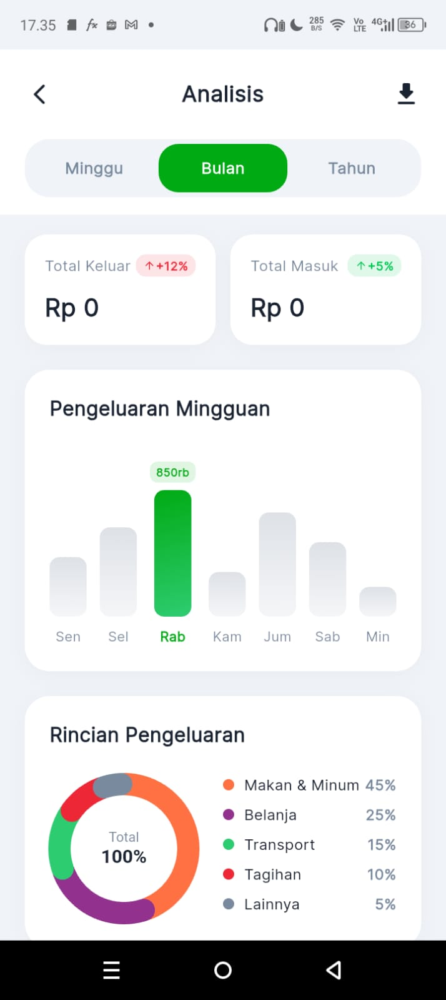
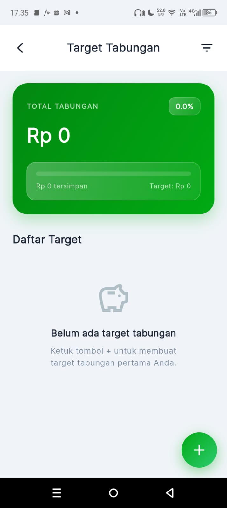
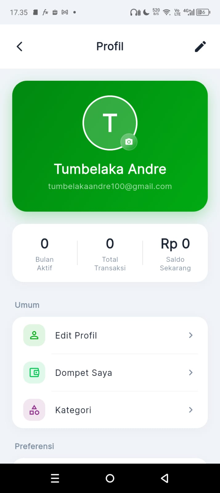

# JOJOwallet

Aplikasi **personal finance tracker berbasis Flutter** untuk membantu pengguna mencatat pemasukan, pengeluaran, serta mengelola target tabungan dengan tampilan modern dan interaktif.

---

# Preview Aplikasi


<p align="center">
  
  
  
  
  
  
  
  
  
</p>

---

# Fitur Utama

## Autentikasi

* Login pengguna
* Onboarding screen interaktif

## Dashboard

* Ringkasan total saldo
* Quick action transaksi
* Animated balance counter

## Manajemen Transaksi

* Tambah pemasukan
* Tambah pengeluaran
* Kategori transaksi
* Riwayat transaksi

## Target Tabungan

* Membuat target tabungan
* Monitoring progres tabungan

## Analytics

* Statistik pengeluaran
* Visualisasi kategori transaksi

## Profil Pengguna

* Informasi akun
* Pengaturan dasar pengguna

---

# Tech Stack

Project ini dibuat menggunakan:

* Flutter
* Dart
* Material UI
* Lottie Animation
* Custom Widgets
* Global State Management (AppState)

---

# Struktur Project

```
lib/
 ├── screens/        → Halaman utama aplikasi
 ├── widgets/        → Komponen UI reusable
 ├── state/          → State management global
 ├── theme/          → Styling & warna aplikasi
 └── utils/          → Formatter & helper function
```

---

# Cara Menjalankan Project

Clone repository:

```
git clone https://github.com/Andretmblkk/JOJOwallet.git
```

Masuk ke folder project:

```
cd JOJOwallet
```

Install dependencies:

```
flutter pub get
```

Run aplikasi:

```
flutter run
```

---

# Arsitektur Aplikasi

Aplikasi menggunakan pendekatan modular sederhana:

* Screen sebagai entry UI utama
* Widget sebagai komponen reusable
* AppState sebagai global state controller
* Utils sebagai helper logic

Struktur ini memudahkan scaling fitur di masa depan.

---

# Roadmap Pengembangan

Fitur yang akan ditambahkan:

* Firebase Authentication
* Cloud Firestore integration
* Export laporan transaksi
* Dark mode
* Notifikasi pengingat finansial
* Multi-account wallet support

---

# Status Project

Saat ini project masih dalam tahap pengembangan aktif.
Beberapa fitur sudah berjalan stabil, sebagian masih dalam proses peningkatan.

---

# Kontribusi

Pull request terbuka untuk improvement UI, performa, atau fitur baru.

---

# Author

Andre Tumbelaka

GitHub:
[https://github.com/Andretmblkk](https://github.com/Andretmblkk)
v